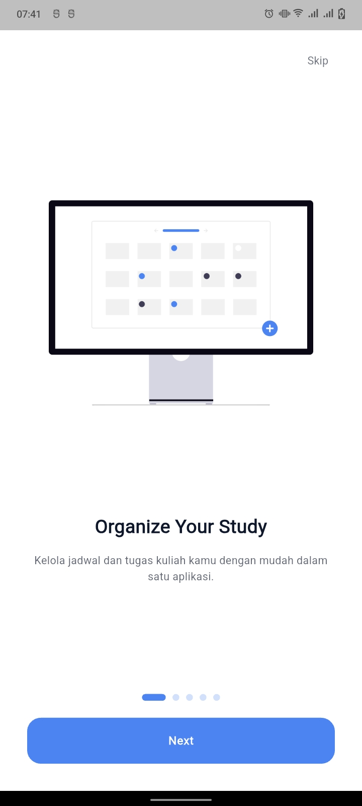
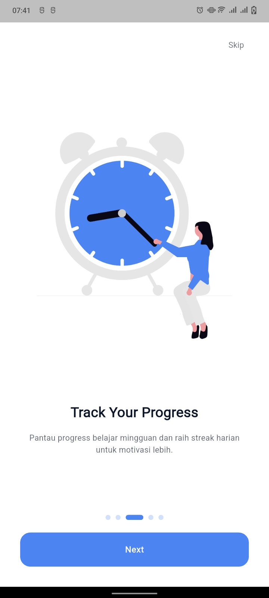
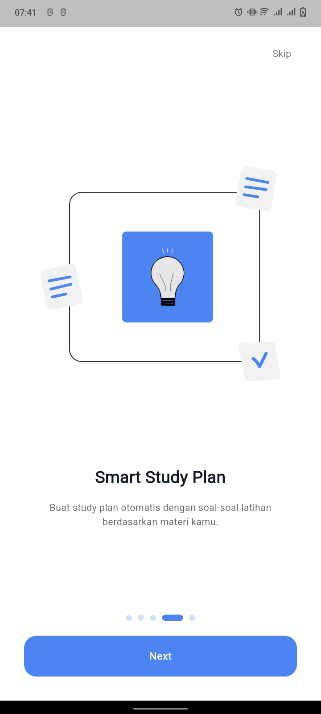
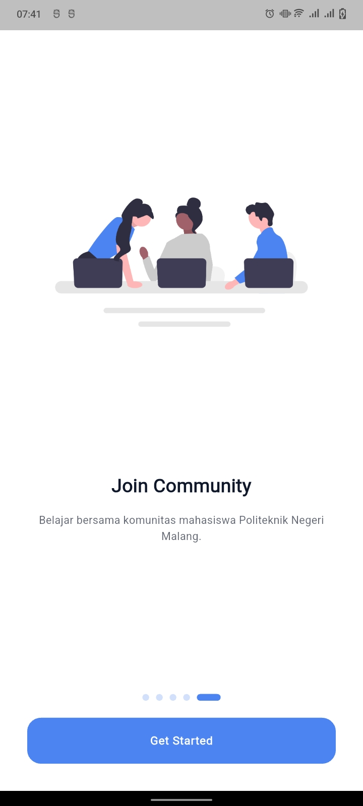

# 📚 MyStudyMate — Smart Academic Organizer for Polinema JTI Students

> MyStudyMate is a mobile application built using Flutter, Supabase, and Laravel API, designed to help university students at organize their academic activities more efficiently. The app provides tools to manage assignments, lecture schedules, events, pomodoro focus sessions, and AI-generated study cards.

---

## 🧭 Deskripsi Singkat
MyStudyMate is designed to be a digital learning assistant for students, equipped with features that support productivity, focus, and consistent study habits.
The main features include the Dashboard, Daily Board, Study Cards, Pomodoro, and Profile, along with an additional Streak system to motivate users to keep learning regularly.

---

## ✨ Main Feature

---

### 🧑‍💻 0. Authentication & User Flow
#### **Splashscreen → Onboarding → Welcomescreen**

- Splash screen displays the application logo
- Onboarding introduces the app features
- Welcome screen directs users to Sign In or Sign Up

#### **Sign In**
- Login using username/email and password

#### **Sign Up**
Users are required to fill in:

- Full Name
- Username
- Email
- Password
- Confirm Password

---

### 👤 1. Profile
- Update profile picture
- Edit full name, username, and email 
- Change Password    

---

### 🏠 2. Dashboard
Show main information and navigation to features :

- 🔥 Daily streak (increases when the user completes 1 hour of Pomodoro sessions)
- 📈 Weekly study progress
- 📅 Weekly calendar (scroll left/right) containing schedules and assignment deadlines
- 📱 Feature menu:
  - Daily Board 
  - Study Cards  
  - Pomodoro  

---

### 📝 3. Daily Board
The Daily Board acts as the central hub for managing day-to-day academic activities.
It contains three categories:
📌 **A. Assignment**
Manage coursework with smart reminders.
**Input Form:**

- Assignment name
- Subject
- Deadline
- Description

**Automatic Notifications:**

- 3 days before deadline
- On the deadline day
- 3 days after deadline (if not completed)

📅 **B. Lecture Schedule**
Used for recording class schedules.

**Input Form:**

- Course name
- Lecturer name
- Start time & end time
- Description

**Notification:**
30 minutes before class begins

**🎉 C. Event**

Used to store non-academic or personal events.

**Input Form:**

- Event title
- Description
- Time
- Event date

---

### 🧠 5. Study Cards (Generate Quiz)
A learning feature that generates quiz questions from user-provided text.

- User inputs study material in text form
- Sent to meta/meta-llama-3-70b-instruct model
- AI generates quiz questions
- User can take the quiz directly

---

### ⏳ 6. Pomodoro Timer

- A focus timer using the 25–5 pomodoro technique.
- 25 minutes focus
- 5 minutes break
- When focus ends → sound + pop-up notification
- When user tries to exit mid-pomodoro → warning alert
- Completing 1 hour of focus time grants 1 streak

---

### 🚀 Future Development

Planned features for the next version:

📝 Notes

A notepad-like feature for summarizing lessons.

🏅 Reward Badges

Gamification system to motivate consistent study habits.

---

## 🧩 Tech Stack

| Category                          | Technology / Version                                                                                                                                      |
| --------------------------------- | --------------------------------------------------------------------------------------------------------------------------------------------------------- |
| **Mobile Framework**              | Flutter **3.35.2**                                                                                                                                        |
| **Programming Language (Mobile)** | Dart (SDK **^3.7.0**)                                                                                                                                     |
| **Mobile Packages (Main)**        | supabase_flutter ^2.7.0, firebase_core ^3.8.1, firebase_messaging ^15.1.5, dio ^5.9.0, flutter_secure_storage ^9.2.4, flutter_local_notifications ^18.0.1 |
| **Android Development**           | Kotlin **2.1.0**, AGP **8.9.1**, Java **11**, Google Services Plugin **4.4.0**                                                                            |
| **Backend Framework**             | Laravel **^10.10**                                                                                                                                        |
| **Backend Language**              | PHP **^8.2**                                                                                                                                              |
| **Laravel Packages**              | Sanctum ^3.3, kreait/laravel-firebase ^5.10, google/auth ^1.49, guzzle ^7.2, phpword ^1.3, pdfparser ^2.12                                                |
| **Database**                      | Supabase (PostgreSQL)                                                                                                                                     |
| **Authentication**                | Supabase Auth                                                                                                                                             |
| **Notifications**                 | Firebase Cloud Messaging (FCM)                                                                                              |
| **UI/UX Design**                  | Figma                                                                                                                                                     |
| **Version Control**               | GitHub                                                                                                                                                    |
| **Supporting Tools**              | Visual Studio Code, Android Studio                                                                                                                        |

---

## 👥 Development Team & Responsibilities

| Name                           | Role                             | Responsibilities                                                                                                                                    |
| ------------------------------ | -------------------------------- | --------------------------------------------------------------------------------------------------------------------------------------------------- |
| **Sabrina Rahmadini**          | Project Manager & UI/UX Designer | Handles planning, scheduling, requirement analysis, UI/UX design, Figma workflow, and feature validation.                                           |
| **Ahmad Yazid Ilham Zulfiqor** | Frontend Developer               | Implements UI in Flutter, connects app to Supabase, develops Daily Board, Pomodoro, Study Cards, and handles notification logic & state management. |
| **Satriya Viar Citta Purnama** | Backend Developer                | Designs Supabase schema, develops Laravel API, implements authentication, Replicate AI integration, CRUD endpoints, and backend validation.         |
| **Azaria Cindy Sahasika**      | System Analyst & QA              | Creates flowcharts & ERD, tests features (Blackbox/Functional/E2E), documents PMPL, and reports bugs based on actual app usage.                     |

---

## 🧪 Quality Assurance (PMPL)

| Testing Level | Purpose | Tools |
|------------------|--------|-------|
| Unit Test | Validasi logika kecil, validator, model | `flutter test` |
| Integration Test | CRUD Supabase + UI | `flutter drive` |
| UI/E2E Test | Flow pengguna | Appium / custom driver |
| Metrics | Code Coverage, Fault Detection Rate | — |

---

## 📸 UI Development Progress

The following is the development of the MyStudyMate application display which has been successfully implemented from design to Flutter:
---

### 🟦 Splash Screen
![Splash Screen]

### 🟦 Welcome Screen
![Welcome Screen]

---

## 🧭 Auth Screens
![Sign Up]
![Sign In]
![Sign Out]

---

## 🧭 Onboarding Screens
![Onboarding 1]
![Onboarding 2]
![Onboarding 3]
![Onboarding 4]
![Onboarding 5]

---

## 🏠 Homescreen
![Home screen]

---

## 📝 Daily Board
### Assignment List
![Assignment Screen]

### Add Assignment
![Add Assignment]
![Add Assignment]
![Add Assignment]

## 🗓️ Schedule  
### Schedule List
![Schedule Screen]

### Add Schedule
![Add Schedule]
![Add Schedule]
![Add Schedule]

### Edit Schedule
![Edit Schedule]

## 🗓️ Event 
### Event List
![Event Screen]

### Add Event
![Add Event]

## Notification
![Notification]

---

## 👤 Profile
### Profile Page
![Profile Screen]

### Edit Profile
![Edit Profile]

### Change Password
![Change Password]

---

## ⏳ Pomodoro
![Pomodoro Screen]
![Pomodoro Screen]
![Pomodoro Screen]
![Pomodoro Screen]
![Pomodoro Screen]
![Pomodoro Screen]
![Pomodoro Screen]

